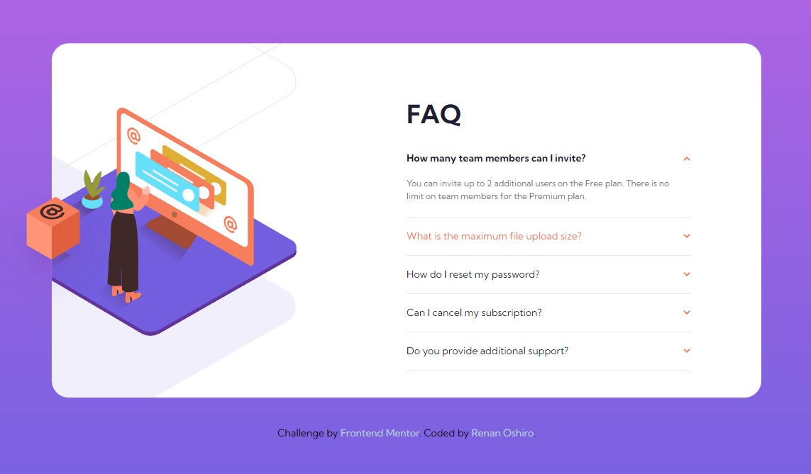

# Frontend Mentor - FAQ accordion card solution

This is a solution to the [FAQ accordion card challenge on Frontend Mentor](https://www.frontendmentor.io/challenges/faq-accordion-card-XlyjD0Oam). Frontend Mentor challenges help you improve your coding skills by building realistic projects.

## Table of contents

- [Overview](#overview)
  - [The challenge](#the-challenge)
  - [Screenshots](#screenshots)
  - [Links](#links)
- [My process](#my-process)
  - [Built with](#built-with)
- [Author](#author)

## Overview

### The challenge

Users should be able to:

- View the optimal layout for the component depending on their device's screen size
- See hover states for all interactive elements on the page
- Hide/Show the answer to a question when the question is clicked

### Screenshots

### Links

[Live Site](https://renanoshiro.github.io/faq-accordion-card/)

## My process

### Built with

- HTML5
- CSS custom properties
- Flexbox
- CSS Grid
- Javascript
- Mobile-first workflow
- [Tailwind CSS](https://tailwindcss.com/) - CSS framework

## Author

- GitHub - [Renan Oshiro](https://github.com/RenanOshiro)
- Frontend Mentor - [@RenanOshiro](https://www.frontendmentor.io/profile/RenanOshiro)
